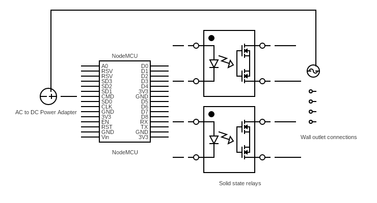
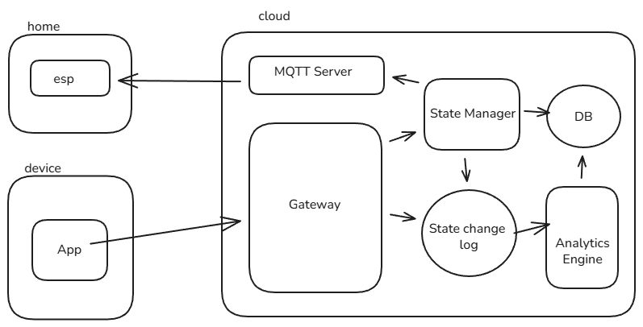
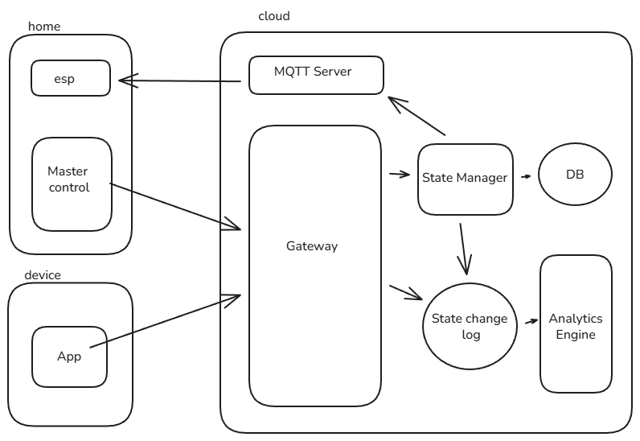

# HOME AUTOMATION

## Overview

This project implements a system to automate home devices (e.g., lights, fans) using the existing electrical grid and network signals — eliminating the need for additional cabling.

---

## Table of Contents

1. About the Project  
2. Key Features  
3. Future Enhancements  
4. System Architecture  
5. Hardware Components  
6. Communication  
7. Software Stack  
8. Adapter Components  
9. Server Architecture  
10. Reference Components

---

## About the Project

Home automation using networked signals over the existing power grid. Devices can be controlled locally and remotely without rewiring.

---

## Key Features

- Switch appliances in the home using a button or touch
- Cloud support for remote toggling
- Automation and scheduling for switching
- Mobile applications for easy control
- Remote control for convenience
- Integration with local sensors for automated switching

---

## Future Enhancements

- Switch-less toggle
- Agent integration
- Custom home power grid
- Integration of smart devices

---

## System Architecture

### How This Works

- The home **router** acts as the primary data link between components.
- Devices consist of small **Wi-Fi enabled microcontrollers** (e.g., NodeMCU, ESP8266).

---

## Hardware Components

### Switches

- Solid State Relays selected for reliability and durability.

### Wiring

- Direct integration with the home electrical grid.
- PoC uses copper/aluminium wiring.
- Integration Circuit Board planned for MVP.

### Controller

- NodeMCU and Arduino controllers
- 8266 modules for Wi-Fi communication

---

## Communication

- Wireless network communication over 2.4 GHz
- Public Internet connection for cloud communication

### Protocols

- **TCP** for local network communication
- **MQTT** for cloud event streaming

---

## Software Stack

- Arduino IDE for microcontroller programming
- MQTT Broker
- Python for CRUD operations
- PostgreSQL for data storage
- Oracle Cloud for backend support
- Android for mobile applications

---

## Adapter Components

  

---

## Server Architecture

### High Level Design — MVP1

  

### High Level Design — MVP2

  

---

## Reference Components

- **ESP32 Module**  
  https://www.amazon.com/ESP-WROOM-32-Development-Aideepen-Compatible-MicroPython/dp/B0BQJ8BTVB/ref=sr_1_6

- **Solid State Relays**  
  https://roboticsdna.in/product/4-channel-3-24v-relay-module-solid-state-low-level-ssr-dc-control-dc-with-resistive-fuse
